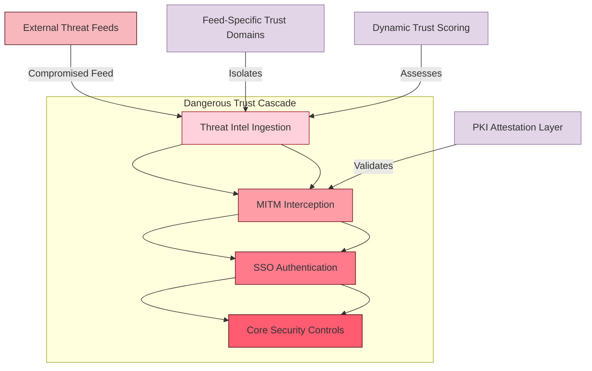

# AegisGate Project TODO

## Version: v0.18.3 (Post-v0.18.2 Strategic Implementation)

---

## COMPLETED PHASES

### Phase 1-9: Foundation & Core ✅
- All previous phases complete
- v0.18.2 Enterprise Readiness (Complete)

### Phase 10: Strategic Implementation (Current)

#### Priority 1: Architecture Maturity (v0.19.0)
- [ ] Implement dynamic threat-reward feedback loops
- [ ] Add PKI attestation to MITM interception
- [ ] Implement real-time policy evolution tracking
- [ ] Transform to living security ecosystem architecture

#### Priority 2: Market Adoption Enablement (v0.18.3)
- [ ] Create simple installer for deployment UX
- [ ] Build config generator tool
- [ ] Implement threat intel enrichment API
- [ ] Add behavioral analytics layer

#### Priority 3: Compliance Value Delivery (v0.20.0)
- [ ] Build cryptographic audit trails
- [ ] Create compliance storytelling dashboards
- [ ] Implement atomic write validation
- [ ] Add privacy compliance (GDPR, CCPA)

---

## GAPS & RISKS (from v0.18.2 Analysis)

| Gap | Current | Missing | Priority |
|-----|---------|---------|----------|
| Threat Intel | STIX/TAXII ingestion | Automated IOC correlation | HIGH |
| Behavioral Analytics | Static rule matching | ML-based detection | HIGH |
| Auditability | WAL & snapshots | Atomic write validation | MEDIUM |
| Deployment | Complex YAML config | Simple installer, config generator | MEDIUM |

---

## STRATEGIC INITIATIVES

### Live Security Ecosystem (v0.19.0)
Goal: Transform AegisGate from static gateway to living security ecosystem

- [ ] **Dynamic Threat-Reward Feedback Loops**
  - Adaptive response grading based on observed threat evolution
  - Real-time policy updates based on threat landscape shifts
  - Behavior-based threat scoring

- [ ] **PKI Attestation for MITM**
  - Trust anchor validation for MITM interception
  - Certificate chain verification
  - Backdoor prevention via attestation

- [ ] **Real-time Policy Evolution Tracking**
  - Compliance drift detection
  - Policy versioning and audit trail
  - Automated policy updates

---

### Deployment UX Enhancement (v0.18.3)
Goal: Reduce deployment friction and accelerate time-to-value

- [ ] **Simple Installer Package**
  - Windows installer (.exe)
  - macOS package (.pkg)
  - Linux deb/rpm packages
  - Zero-config default deployment

- [ ] **Config Generator Tool**
  - Interactive CLI config wizard
  - Template-based configuration builder
  - Best-practice presets (HIPAA, PCI-DSS, etc.)
  - Visual configuration editor (web UI)

- [ ] **Threat Intel Enrichment API**
  - Live IOC correlation service
  - Automated threat intelligence updates
  - Threat feed aggregation and normalization
  - Predictive threat scoring

- [ ] **Behavioral Analytics Layer**
  - ML-based signal processing
  - Adaptive pattern recognition
  - Anomaly detection with continuous learning
  - Prompt injection detection models

---

### Compliance Value Delivery (v0.20.0)
Goal: Make compliance measurable, trackable, and valuable

- [ ] **Cryptographic Audit Trails**
  - Atomic write validation with Merkle trees
  - Tamper-proof event logging
  - Automated compliance evidence generation

- [ ] **Compliance Storytelling Dashboards**
  - Executive-level compliance metrics
  - Automated compliance reporting
  - Audit trail visualization
  - Risk assessment dashboards

- [ ] **Privacy Compliance**
  - GDPR compliance module
  - CCPA/CPRA support
  - Data subject rights automation
  - Privacy impact assessment toolkit

---

## FUTURE PHASES

### Phase 11: v1.0.0 Production Release
- [ ] Complete all v0.19.x and v0.20.x milestones
- [ ] Production readiness validation
- [ ] Enterprise support infrastructure
- [ ] Documentation completion

---

**Started**: 2026-02-13 07:05:00
**Updated**: 2026-02-24 06:29:00 (strategic analysis implementation)
**Current Version**: v0.18.3 (planned)
**Overall Project Status**: 99% Complete - Strategic Enhancement Phase

---

## TRUST LATTICE VULNERABILITY REMEDIATION

### Priority 1: PKI Attestation for MITM Interception
Goal: Add certificate chain verification and trust anchor validation

- [ ] **Implement PKI Attestation Framework**
  - Build trust anchor validation system
  - Certificate chain verification (root → intermediate → leaf)
  - Backdoor prevention via cryptographic attestation
  - Implement revocation checking (CRL/OCSP)

- [ ] **MITM Security Hardening**
  - Separate trust domains for different threat feeds
  - Isolation between threat intel ingestion and core proxy
  - Multi-party verification for trust anchor updates

### Priority 2: Threat Intel Isolation
Goal: Prevent compromised feeds from affecting entire system

- [ ] **Feed-Specific Trust Domains**
  - Isolate trust anchors per threat intelligence feed
  - Implement feed-level sandboxing
  - Create boundaries between external feeds and internal systems

- [ ] **Integrity Verification**
  - Digital signature verification for all threat feeds
  - Hash-chain validation for feed history
  - Tamper-evident logging for feed modifications

### Priority 3: Dynamic Trust Assessment
Goal: Adaptive trust scoring rather than static trust

- [ ] **Trust Scoring Engine**
  - Calculate reputation scores based on feed behavior
  - Real-time threat correlation confidence scoring
  - Automated trust downgrade for suspicious activity

- [ ] **Response Isolation**
  - Implement fail-safe mechanisms for compromised feeds
  - Automatic isolation of affected security controls
  - Manual review workflow for trust anchor changes

### Implementation Timeline:
- Week 1-2: PKI attestation framework design and implementation
- Week 3-4: Feed isolation architecture and trust domain creation
- Week 5-6: Dynamic trust scoring engine
- Week 7-8: Integration testing and validation

### Documentation Requirements:
- PKI Attestation Architecture Design Document
- Trust Lattice Attack Vectors Analysis
- Incident Response Procedures for Trust Compromise

---

## TRUST LATTICE ARCHITECTURE DIAGRAM

## VERIFICATION CHECKLIST

After implementing trust lattice remediation:

- [ ] All threat feeds verified with digital signatures before ingestion
- [ ] Certificate chain validation for all MITM interception
- [ ] Feed isolation prevents single feed compromise from affecting others
- [ ] Trust scoring engine actively monitors feed behavior
- [ ] Trust downgrade automatic thresholds tested and verified
- [ ] Incident response procedures documented and tested

---

**Added**: 2026-02-24
**Version**: v0.18.3 Enhancement
