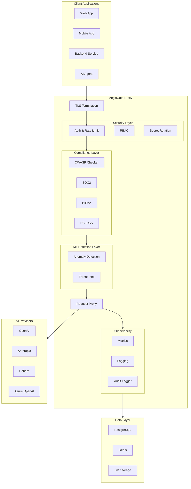
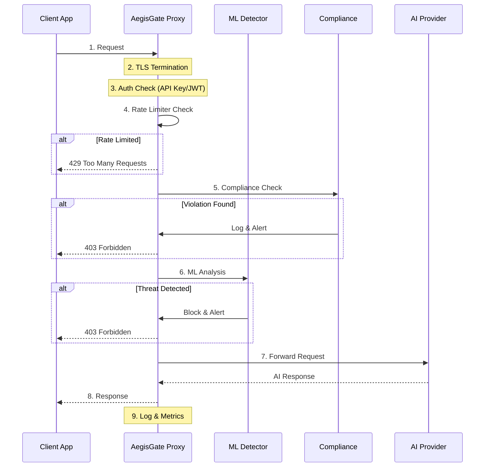
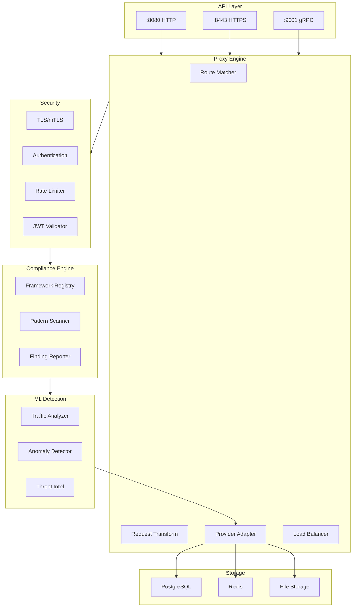
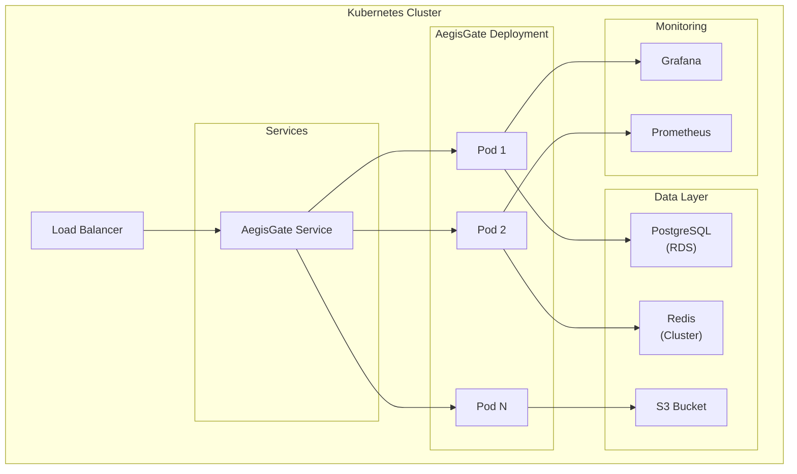
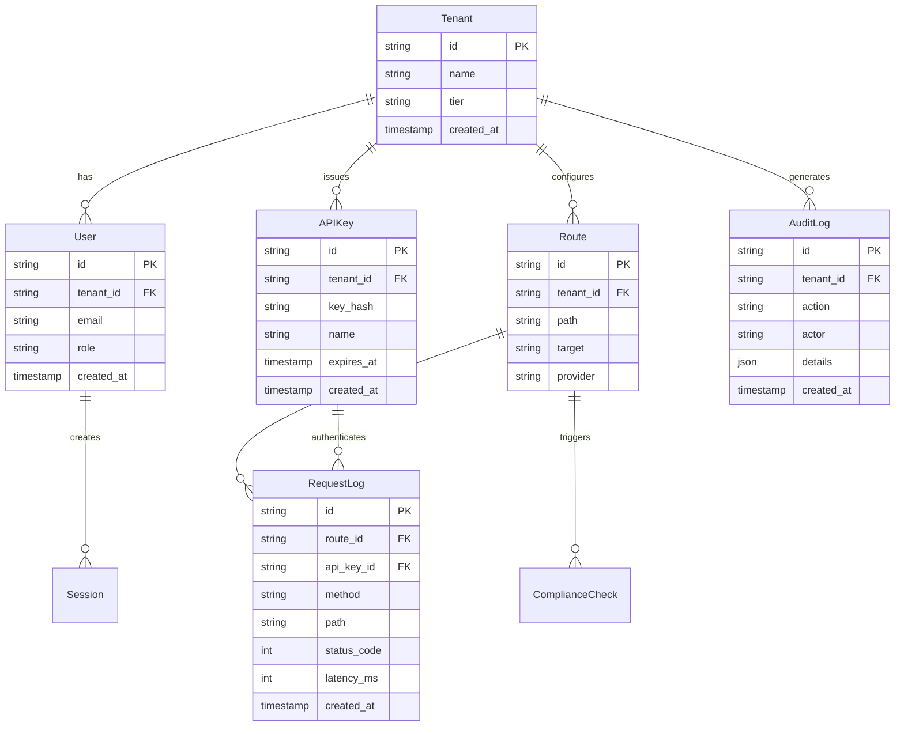
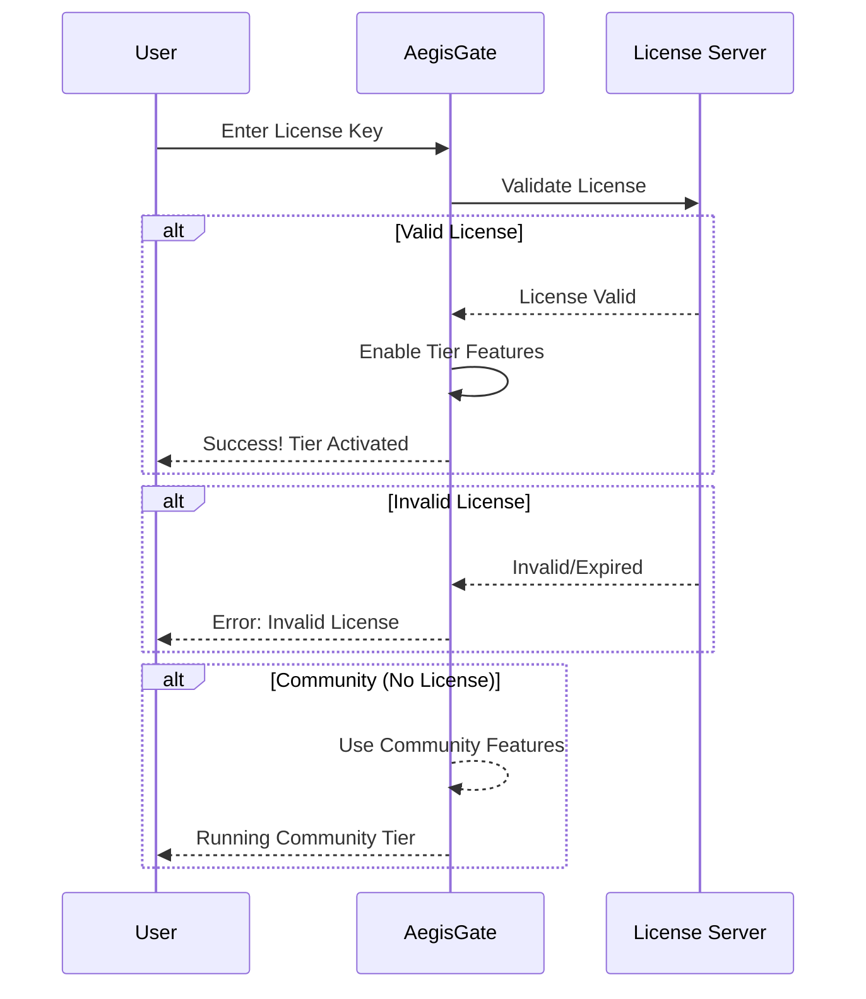
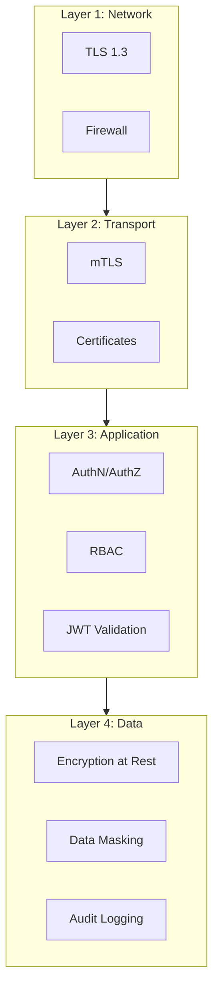

# AegisGate Architecture Diagrams

This document contains architecture diagrams for AegisGate using Mermaid.

---

## 1. High-Level Architecture



---

## 2. Request Flow



---

## 3. Component Architecture



---

## 4. Tier Architecture

```mermaid
flowchart LR
    subgraph Community["COMMUNITY (Free)"]
        C1["Basic Proxy"]
        C2["Rate Limiter"]
        C3["OWASP View"]
        C4["Basic Metrics"]
    end

    subgraph Developer["DEVELOPER ($29/mo)"]
        D1["All Community"]
        D2["PostgreSQL"]
        D3["OAuth/SSO"]
        D4["Cost Alerts"]
        D5["Grafana"]
    end

    subgraph Professional["PROFESSIONAL ($99/mo)"]
        P1["All Developer"]
        P2["HIPAA/PCI/SOC2"]
        P3["Multi-Tenant"]
        P4["ML Threat Detection"]
        P5["SIEM Integration"]
    end

    subgraph Enterprise["ENTERPRISE (Custom)"]
        E1["All Professional"]
        E2["ISO 42001/FedRAMP"]
        E3["HSM/FIPS"]
        E4["On-Premise"]
        E5["Air-Gapped"]
    end

    Community --> Developer
    Developer --> Professional
    Professional --> Enterprise
```



---

## 5. Kubernetes Deployment



---

## 6. Database Schema Overview



---

## 7. Rate Limiting Flow

```mermaid
flowchart TB
    Request["Request"] --> KeyGen["Generate Key\n(API Key or IP)"]

    KeyGen --> Lookup["Lookup in\nToken Bucket"]

    subgraph Check["Rate Limit Check"]
        Tokens["Tokens Available?"]
    end

    Lookup --> Tokens

    alt Yes
        Tokens --> Decrement["Decrement Token"]
        Decrement --> Forward["Forward Request"]
        Forward --> Success["200 OK"]
    end

    alt No
        Tokens --> Block["Block Request"]
        Block --> RateLimited["429 Rate Limited"]
        RateLimited --> Retry["Retry-After: 60s"]
    end

    subgraph Cleanup["Background Cleanup"]
        Timer["Timer\n(every minute)"]
        Timer --> Remove["Remove Stale Entries"]
    end
```

---

## 8. Compliance Checking Flow

```mermaid
flowchart TB
    Request["Request"] --> Parse["Parse Request"]

    Parse --> Match["Match Against\nPatterns"]

    subgraph Evaluate["Evaluation"]
        OWASP["OWASP Patterns"]
        PII["PII Detection"]
        Sensitive["Sensitive Data"]
    end

    Match --> Evaluate

    Evaluate --> Violation["Violation Found?"]

    alt Yes
        Violation --> Log["Log Finding"]
        Log --> Alert["Generate Alert"]
        Alert --> Action["Action: Block/Log/Warn"]
    end

    alt No
        Violation --> Forward["Forward Request"]
    end

    subgraph Report["Reporting"]
        Summary["Generate Summary"]
        Export["Export: JSON/PDF"]
    end

    Log --> Report
    Forward --> Report
```

---

## 9. License Activation Flow



---

## 10. Security Layers



---

*Diagrams rendered with Mermaid. For more information, see [architecture.md](architecture.md).*
